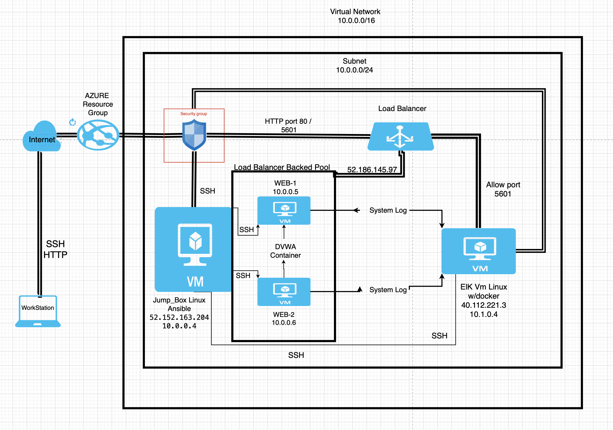
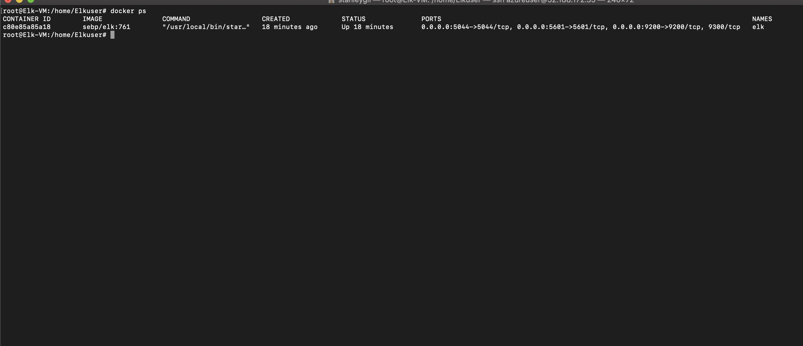

## Automated ELK Stack Deployment

The files in this repository were used to configure the network depicted below.

These files have been tested and used to generate a live ELK deployment on Azure. They can be used to either recreate the entire deployment pictured above. Alternatively, select portions of the yml file may be used to install only certain pieces of it, such as Filebeat.
---
  - name: installing and launching filebeat
    hosts: webservers
    become: yes
    tasks:
    - name: download filebeat deb
      command: curl -L -O https://artifacts.elastic.co/downloads/beats/filebeat/filebeat-7.4.0-amd64.deb
    - name: install filebeat deb
      command: dpkg -i filebeat-7.4.0-amd64.deb
    - name: drop in filebeat.yml
    copy:
      src: /etc/ansible/files/filebeat-config.yml
      dest: /etc/filebeat/filebeat.yml
    - name: enable and configure system module
      command: filebeat modules enable system
    - name: setup filebeat
      command: filebeat setup
    - name: start filebeat service
      command: service filebeat start

This document contains the following details:
- Description of the Topologu
- Access Policies
- ELK Configuration
  - Beats in Use
  - Machines Being Monitored
- How to Use the Ansible Build

### Description of the Topology

The main purpose of this network is to expose a load-balanced and monitored instance of DVWA, the D*mn Vulnerable Web Application.

Load balancing ensures that the application will be highly available, in addition to restricting access to the network.
-  What aspect of security do load balancers protect? Distribute traffic evenly across the servers and mitigates DoS attacks.
-  What is the advantage of a jump box? An operating system, that could be use as a normal computers.

Integrating an ELK server allows users to easily monitor the vulnerable VMs for changes to the auditd and sys logs.
- What does Filebeat watch for?
  Filebeat is a lightweight shipper for forwarding and centralizing log data. Installed as an agent on your servers.

- What does Metricbeat record? 
  Metricbeat helps you monitor your servers by collecting metrics from the system and services running on the server, such
  as: Apache,HAProxy

The configuration details of each machine may be found below.

| Name     | Function | IP Address | Operating System |
|----------|----------|------------|------------------|
| Jump Box | Gateway  | 10.0.0.4   | Linux w/Ansible  |
| Web-1    | Container| 10.0.0.5   | Linux w/DVWA     |
| Web-2    | Container| 10.0.0.6   | Linux w/DVWA     |
| Elk-Vm   | Monitor  | 10.1.0.4   | Linux w/ELK stack|

### Access Policies

The machines on the internal network are not exposed to the public Internet. 

Only the JUMP BOX machine can accept connections from the Internet. Access to this machine is only allowed from the following IP addresses:
-  52.152.163.204

Machines within the network can only be accessed by SSH.
- Which machine did you allow to access your ELK VM? Web-1 and Web-2  What was its IP address? 10.0.0.5 and 10.0.0.6

A summary of the access policies in place can be found in the table below.

| Name     | Publicly Accessible | Allowed IP Addresses |
|----------|---------------------|----------------------|
| Jump Box |     Yes             |  52.152.163.204      |
|   Web-1  |     no              |  10.0.0.5            |
|   Web-2  |     no              |  10.0.0.6            |
|  Elk-Vm  |     yes             |  40.112.221.3:5601   |
### Elk Configuration

Ansible was used to automate configuration of the ELK machine. No configuration was performed manually, which is advantageous because...
- What is the main advantage of automating configuration with Ansible?
  Ansible can be run from the command line without the use of configuration files 
  for simple tasks, such as making sure a service is running, or to trigger updates or reboots.

The playbook implements the following tasks:
- In 3-5 bullets, explain the steps of the ELK installation play. E.g., install Docker; download image; etc._
- ---
1. Çreate The Yaml file.
2. Configured the hosts file.
3. Run the Playbook.

  - name: Configure Elk VM with Docker
    hosts: Elkuser
    remote_user: ansible
    become: true
    tasks:
      Use apt module
      - name: Install docker.io
        apt: 
          update_cache: yes
          name: docker.io
          state: present

      Use apt module
      - name: Install python3-pip
        apt:
          force_apt_get: yes
          name: python3-pip
          state: present

      Use pip module (It will default to pip3)
      - name: Install Docker module
        pip:
          name: docker
          state: present

      Use command module
      - name: Increase virtual memory
        command: sysctl -w vm.max_map_count=262144

      Use sysctl module
      - name: Use more memory
        sysctl:
          name: vm.max_map_count
          value: 262144
          state: present
          reload: yes

      Use docker_container module
      - name: download and launch a docker elk container
        docker_container:
          name: elk
          image: sebp/elk:761
          state: started
          restart_policy: always
      Please list the ports that ELK runs on
          published_ports:
          -  5601:5601
          -  9200:9200
          -  5044:5044

The following screenshot displays the result of running `docker ps` after successfully configuring the ELK instance.

### Target Machines & Beats
This ELK server is configured to monitor the following machines:
- Web-1 10.0.0.5
- Web-2 10.0.0.6

We have installed the following Beats on these machines:
- FileBeats and Metricbeats

These Beats allow us to collect the following information from each machine:
- In 1-2 sentences, explain what kind of data each beat collects, and provide 1 example of what you expect to see. E.g., `Winlogbeat` collects 
Windows logs, which we use to track user logon events, etc.

 Filebeat: monitors the log files or locations that you specify, collects log events, and forwards them either to Elasticsearch or Logstash for indexing.
 Metricbeat: takes the metrics and statistics that it collects and ships them to the output that you specify, such as Elasticsearch or Logstash.

### Using the Playbook
In order to use the playbook, you will need to have an Ansible control node already configured. Assuming you have such a control node provisioned: 

SSH into the control node and follow the steps below:
- Copy the filebeat-config.yml to Files.

- Update the ansible-config.yml file to include Elk-VM IP Address

- Run the playbook, and navigate to /etc/filebeat/filebeat.yml to check that the installation worked as expected.

- Answer the following questions to fill in the blanks:

- Which file is the playbook?
  filebeat-playbook.yml  

- Where do you copy it?
  in to the roles Dicrectory

- Which file do you update to make Ansible run the playbook on a specific machine? 
  ansible.cfg , hosts

- How do I specify which machine to install the ELK server on versus which to install Filebeat on? 
  Within the Filebeat.yml file on the Hosts name type the name of the host you trying to installed to.
  
- Which URL do you navigate to in order to check that the ELK server is running ?
   http://[your.ELK-VM.External.IP]:5601/app/kibana

- As a **Bonus**, provide the specific commands the user will need to run to download the playbook, update the files, etc._
  ansible-playbook # ELK-Stack-Projects
